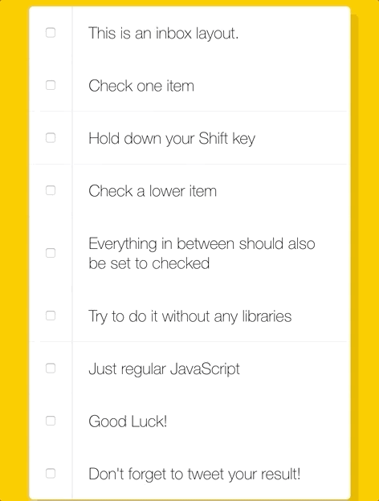

# js30-10-checkbox-challenge
multi select shortcut for checkboxes! https://youtu.be/RIPYsKx1iiU

check and uncheck boxes as normal. 
Wanna check a bunch off at once? Hold down shift, and click one
All of them should select

- enhancement ideas, make the items labels so the whole area is clickable/tappable
- make it work with key board input as well as clicking
      - i.e. tab to input, hold shift, press spacebar and have the same effect

